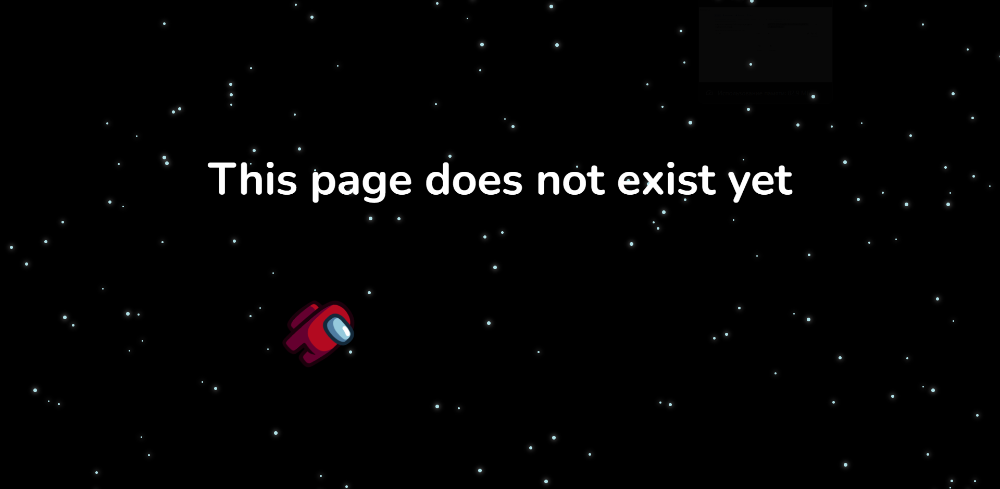

# Gyroscope and Cursor Tracking Experiment
This experimental page was created to test the ability to capture and interact with gyroscope data from devices. Additionally, for desktop users, I implemented mouse cursor tracking for a more engaging experience.

## Features
- Gyroscope Tracking: On Android devices, the page responds to your device's movements using the built-in gyroscope (unfortunately, this feature is not supported on iOS).
- Mouse Tracking: For desktop users, the cursor movement is tracked, creating an interactive visual experience.
- Interactive Element: Clicking on the astronaut triggers a loud sound—please be aware of your volume settings before interacting.
# Warning
### Clicking on the astronaut will produce a loud sound. Make sure your volume is adjusted to a comfortable level to avoid surprises!

## Usage
- On Android devices, tilt or rotate your device to see the gyroscope in action.
- On desktops, move your mouse around to experience cursor tracking.

- 
